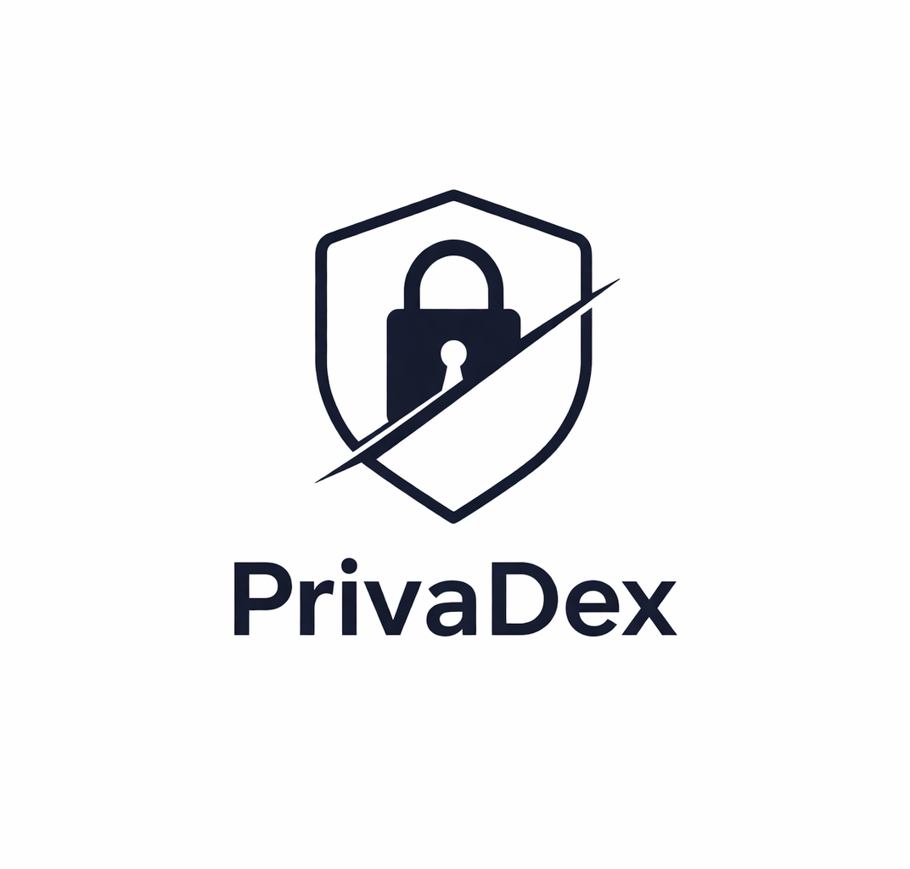

<p align="center">
  
</p>

<h1 align="center">PrivaDEX</h1>

<p align="center">
  Privacy-first decentralized exchange on <strong>Aleo</strong> — fully shielded swaps, liquidity pools, dark pool, and order book powered by zero-knowledge proofs.
</p>

<p align="center">
  <a href="https://priva-dex.vercel.app/"><strong>Live Demo</strong></a>
</p>

## Tech Stack

| Layer | Technology |
|---|---|
| Framework | React 18 + TypeScript |
| Build | Vite 6 |
| Styling | Tailwind CSS 4 |
| Routing | React Router DOM 7 |
| Blockchain | Aleo Testnet (via `@provablehq/sdk` + Shield Wallet) |
| Charts | Recharts |
| Animation | Motion (Framer Motion) |
| Tables | TanStack React Table |

## Features

- **Token Swap** — AMM-based swap across 6 pool pairs with blind routing and reserve snapshot verification
- **Liquidity Pools** — Add/remove liquidity with auto-ratio calculation, slippage protection, and on-chain LP positions
- **Dark Pool** — Private epoch-based trading (ALEO/USDCx only)
- **Order Book** — Limit orders with ZK-shielded execution (ALEO/USDCx only)
- **Faucet** — Mint testnet tokens (ALEO via faucet.aleo.org, USDCx via faucet.circle.com, BTCx/ETHx on-chain)
- **Portfolio** — Real-time balance tracking (private + public) for ALEO, USDCx, BTCx, ETHx
- **Analytics** — Live on-chain protocol metrics, TVL tracking, spot prices, dark pool epoch state
- **Privacy Shield** — Toggle to hide/reveal sensitive values in the UI

## Tokens

| Symbol | Type | Source |
|---|---|---|
| ALEO | Native credits | `credits.aleo` |
| USDCx | Stablecoin (test) | `test_usdcx_stablecoin.aleo` (private Token + MerkleProof compliance) |
| BTCx | Synthetic Bitcoin | `token_registry.aleo` (ID: `201field`) |
| ETHx | Synthetic Ethereum | `token_registry.aleo` (ID: `202field`) |

## Pages

| Route | Description |
|---|---|
| `/` | Landing page |
| `/swap` | Token swap with blind router (auto-selects best venue) |
| `/pool` | Liquidity pool management (All Pools + My Positions) |
| `/darkpool` | Dark pool trading (ALEO/USDCx) |
| `/orders` | Order book (ALEO/USDCx) |
| `/portfolio` | Portfolio overview with balance breakdown |
| `/analytics` | Live on-chain TVL, spot prices, volume, dark pool status |
| `/faucet` | Testnet token faucet & convert to private |

## Getting Started

```bash
# Install dependencies
npm install

# Configure environment
cp .env.example .env   # or edit .env directly

# Start dev server
npm run dev             # http://localhost:5173
```

### Environment Variables

```bash
# Network
VITE_RPC_URL=https://api.explorer.provable.com/v1
VITE_NETWORK=testnet

# Program IDs (deployed on Aleo testnet)
VITE_PROGRAM_TOKEN=privadex_token_v2.aleo
VITE_PROGRAM_AMM=privadex_amm_v9.aleo
VITE_PROGRAM_AMM_BTCX=privadex_amm_btcx_v5.aleo
VITE_PROGRAM_AMM_ETHX=privadex_amm_ethx_v5.aleo
VITE_PROGRAM_AMM_NATIVE_BTCX=privadex_amm_native_btcx_v6.aleo
VITE_PROGRAM_AMM_NATIVE_ETHX=privadex_amm_native_ethx_v6.aleo
VITE_PROGRAM_AMM_BTCX_ETHX=privadex_amm_btcx_ethx_v5.aleo
VITE_PROGRAM_USDCX=test_usdcx_stablecoin.aleo
VITE_PROGRAM_TOKEN_REGISTRY=token_registry.aleo
VITE_PROGRAM_DARKPOOL=privadex_darkpool_v4.aleo
VITE_PROGRAM_ORDERBOOK=privadex_orderbook_v4.aleo
VITE_PROGRAM_ROUTER=privadex_router_v2.aleo

# Faucet (testnet only)
VITE_FAUCET_PRIVATE_KEY=<admin-private-key>
VITE_FAUCET_ADDRESS=<admin-address>

# Record Scanner (optional — reliable record discovery via Provable RSS)
VITE_SCANNER_URL=https://api.provable.com/scanner
VITE_SCANNER_API_KEY=
VITE_SCANNER_CONSUMER_ID=
```

## Architecture

```
src/
  components/
    layout/         AppShell (navbar + page wrapper)
    shared/         Reusable UI (TokenSelector, GlassCard, TokenIcon,
                    PrivacyBadge, AnimatedNumber, ConnectModal, etc.)
  context/
    WalletContext    Wallet connection, balances (private+public), shield toggle,
                    Record Scanner integration
  hooks/
    usePoolOperations   Add/remove liquidity (3-phase: prepare → snapshot → execute)
    useSwapExecute      Swap execution across AMM, dark pool, order book
                        with reserve snapshot verification
    useBlindRouter      Route optimization across venues (AMM recommended,
                        dark pool/orderbook for ALEO/USDCx only)
    useOnChainPools     Real-time pool reserves, volume tracking via reserve
                        delta detection, cumulative metrics
    useMyLpPositions    Fetch real LP position records from all AMM programs
    useDarkPoolState    Dark pool epoch state
    usePortfolioData    Portfolio aggregation
    useTokenPrices      External price feeds (CoinGecko)
    useFaucetMint       Testnet token minting (SDK-based for BTCx/ETHx)
  lib/
    aleo.ts             Core Aleo interaction (executeOnChain, fetchPoolReserves,
                        fetchPoolMetrics, record helpers, CPMM math)
    programs.ts         Program IDs, pool config, input builders with
                        reserve snapshot params, MerkleProofs
    router.ts           Blind router logic (venue evaluation, atomic multi-hop)
    venueCapabilities.ts  Venue status flags (live vs experimental)
    prices.ts           CoinGecko price feed with caching
    recordCache.ts      Shared record cache across components
    recordScanner.ts    Provable Record Scanner integration
    spentRecords.ts     Local spent-record tracking
    tradeHistory.ts     Local trade history + pool volume tracker
    faucetMint.ts       SDK-based faucet mint for BTCx/ETHx
    constants.ts        Token decimals, addresses
    utils.ts            General utilities
  pages/
    Landing, Swap, Pool, DarkPool, Orders, Portfolio, Analytics, Faucet
  data/
    tokens.ts           Token definitions, pool metadata, formatters
```

## On-Chain Programs

### AMM Pools (6 pairs)

| Program | Pair | Type |
|---|---|---|
| `privadex_amm_v9.aleo` | ALEO/USDCx | Credits + USDCx MerkleProof |
| `privadex_amm_btcx_v5.aleo` | BTCx/USDCx | Registry token + USDCx MerkleProof |
| `privadex_amm_ethx_v5.aleo` | ETHx/USDCx | Registry token + USDCx MerkleProof |
| `privadex_amm_native_btcx_v6.aleo` | ALEO/BTCx | Credits + registry token |
| `privadex_amm_native_ethx_v6.aleo` | ALEO/ETHx | Credits + registry token |
| `privadex_amm_btcx_ethx_v5.aleo` | BTCx/ETHx | Pure token pair (registry) |

All AMM contracts include:
- **Reserve snapshot verification** — swap/liquidity params include `reserve_a_snapshot`, `reserve_b_snapshot`, `fee_bps_snapshot` verified against live on-chain state in finalize
- **Cumulative metrics** — `cumulative_volume_a/b`, `cumulative_fee_a/b`, `last_swap_block` mappings
- **LP records** — `LPPosition { owner, pool_id, shares }` private records
- **Default fee** — 30 bps (0.3%) built-in, no initialization required

### Other Programs

| Program | Purpose |
|---|---|
| `privadex_darkpool_v4.aleo` | Epoch-based dark pool (ALEO/USDCx) |
| `privadex_orderbook_v4.aleo` | Limit order book (ALEO/USDCx) |
| `privadex_token_v2.aleo` | Private token wrapper with ALEO escrow |
| `privadex_router_v2.aleo` | Atomic multi-hop router (pending deployment) |
| `test_usdcx_stablecoin.aleo` | USDCx stablecoin (shared infrastructure) |
| `token_registry.aleo` | BTCx/ETHx token registry (shared infrastructure) |

## Key Technical Details

### Record Fetching (4-Layer Fallback)

Record discovery is critical for Aleo's UTXO model. `fetchRecordsRobust()` uses:

1. **Shield Wallet React context** — `requestRecords()` from wallet adapter
2. **Direct `window.shield`** — bypasses React state issues during tx flows
3. **Shared record cache** — populated by balance components
4. **Provable Record Scanner** — TEE-based chain scanning (requires API key)

### Add Liquidity Flow (3-Phase)

```
Phase 1: Prepare records
  → Find/split ALEO credits record or token record (>= deposit amount)
  → Find/prepare paired token record (USDCx with MerkleProofs, or registry token)

Phase 2: Snapshot & compute (just before execution)
  → Fetch fresh pool reserves (reserve_a, reserve_b, total_shares)
  → Compute expected LP shares with 2% slippage buffer
  → Verify fee balance after record preparation

Phase 3: Execute with snapshots
  → Build inputs including reserve snapshots for on-chain verification
  → Submit to Shield Wallet → on-chain finalize verifies snapshots match live state
  → Poll transaction status
```

### Swap Flow

```
1. Blind Router evaluates all venues (AMM, Dark Pool, Order Book)
   → Dark Pool and Order Book only available for ALEO/USDCx
   → AMM auto-selected for all other pairs
2. Prepare input record (credits, USDCx, or registry token)
3. Fetch live reserves → compute output → verify against slippage tolerance
4. Check atomic router for better multi-hop rate (e.g. ETHx→ALEO→BTCx)
5. Build inputs with reserve snapshots → execute → poll status
```

### Volume Tracking

24h volume is tracked via two complementary sources:
- **Reserve delta detection** — monitors on-chain reserve changes between polls (captures all users' swaps)
- **Local swap recording** — guaranteed capture of current user's swaps
- Per pool, the higher of both sources is displayed (avoids double-counting)

### Balance Tracking

All token balances combine **private records + public balance**:
- ALEO: private credits records + `credits.aleo/account` mapping
- USDCx: private Token records + `test_usdcx_stablecoin.aleo/balances` mapping
- BTCx/ETHx: private registry Token records + `token_registry.aleo/authorized_balances` mapping (BHP256 hash key)

### Transaction Fee

All transactions use **1.5 ALEO** (1,500,000 microcredits) public fee.

## Local Contracts

Contract workspace lives in `contracts/`.

- Run `npm run contracts:active` to print current program IDs and local source paths
- `contracts/local-programs.json` maps program IDs to local contract folders
- Deploy script: `scripts/deploy-new-versions.sh`

## Scripts

```bash
npm run dev              # Start dev server (port 5173)
npm run build            # Production build (tsc + vite)
npm run preview          # Preview production build
npm run lint             # ESLint
npm run contracts:active # Print active program IDs
npm run darkpool:autosettle:once -- --check-only
npm run darkpool:autosettle
```

Auto-settle keeper docs: `docs/darkpool-autosettle.md`

## Wallet Support

Currently supports **Shield Wallet** (`@provablehq/aleo-wallet-adaptor-shield`).

The app requires:
- Aleo Testnet connection
- `AutoDecrypt` permission for record scanning
- Public ALEO balance for transaction fees

## License

Private — MDlabs
